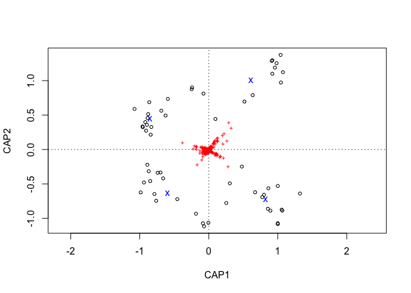
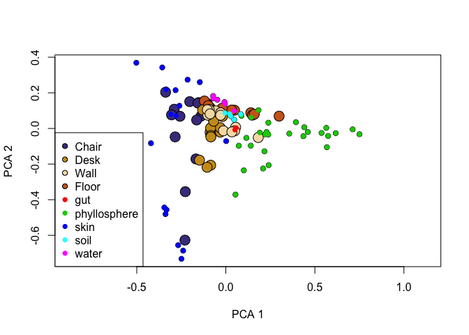
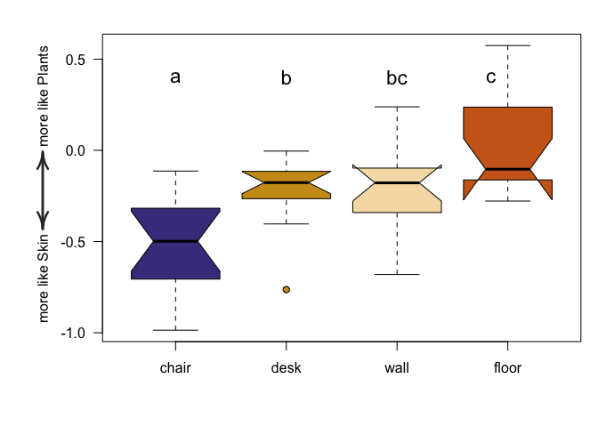
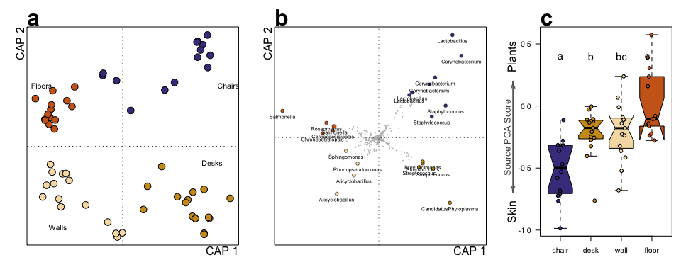
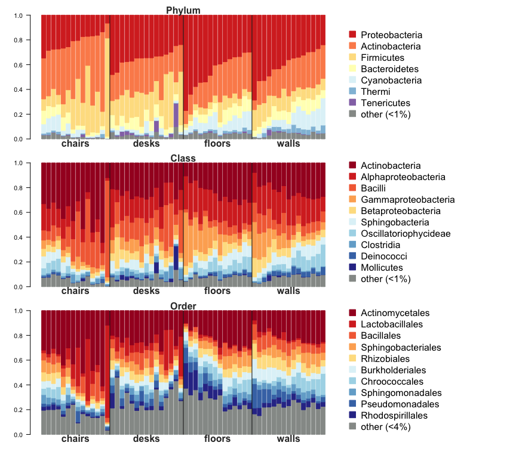

# Bacterial community analysis for surfaces in a university classroom
### **Meadow *et al.* "Bacterial communities on classroom surfaces vary with human contact"**

-----------------

This document contains all statistical analyses conducted for the manuscript. Note that due to the random iterative nature of some analyses (such as beta-rarefaction, DB-RDA & PCA) some of the figure parameters will change slightly during reanalysis, though core results will remain essentially unchanged. 

All data to reproduce analysis can be found here: `https://github.com/jfmeadow/Meadow_etal_Surfaces`

-----------------

Load necessary ecological analysis libraries. 


```r
library(vegan)
```

```
## Loading required package: permute
## Loading required package: lattice
## This is vegan 2.0-10
```

```r
library(labdsv)
```

```
## Loading required package: mgcv
## Loading required package: nlme
## This is mgcv 1.7-28. For overview type 'help("mgcv-package")'.
## Loading required package: MASS
## 
## Attaching package: 'labdsv'
## 
## The following object is masked from 'package:stats':
## 
##     density
```


Pull workspace from big OTU table created for Lillis Air data (Meadow et al. 2013, Indoor Air). Also removed a list of plants and 'no blast hits' as described in that manuscript. 

This beginning workspace contains: 

* `lillis.big.table`: OTU table created with bigger sequence dataset containing airborne bacteria. Swabs are a subset of those samples. 
* `swab.map`: metadata mapping file
* `big.streptos.names`: vector of plant chloroplast OTUs - these get removed.
* `big.nbh.names`: vector of OTUs with no GreenGenes hit to bacteria level - these are also excluded from analysis. 
* `lillis.big.taxa`: taxonomic assignments from GreenGenes database.


```r
load('lillis.RData')
source('functions.R')  #functions for formatting shortcuts.
```


Extract OTU table and remove plant sequences as well as sequences not identified as bacteria. 


```r
swab.table.tmp <- lillis.big.table[row.names(swab.map), 
  -which(colnames(lillis.big.table) %in% c(big.streptos.names, big.nbh.names))]
swab.taxa <- lillis.big.taxa[-which(row.names(lillis.big.taxa) %in% c(big.streptos.names, big.nbh.names)), ]
```

Some important metrics:

* total sequences: 799616
* total samples: 58
* total number of OTUs in this dataset: 5718
* total number of OTUs in bigger dataset (including air): 10782

Even the most depauperate has >4000 sequences, so rarefy to that level. 


```r
swab.table <- rrarefy(swab.table.tmp, 4000)
swab.table <- swab.table[, which(apply(swab.table, 2, sum) > 0)]
swab.taxa <- swab.taxa[colnames(swab.table), ]
```

After rarefaction, some important metrics: 

* total sequences: 2.32 &times; 10<sup>5</sup>
* total number of OTUs: 3752

--------------------

### Results:

Are communities indicative of surface type? In other words, do we have 4 distinct communities on these 4 distinct surfaces?


```r
swab.can <- vegdist(swab.table, 'canberra')
adonis(swab.can ~ swab.map$type)
```

```
## 
## Call:
## adonis(formula = swab.can ~ swab.map$type) 
## 
## Terms added sequentially (first to last)
## 
##               Df SumsOfSqs MeanSqs F.Model    R2 Pr(>F)    
## swab.map$type  3      1.91   0.636    2.31 0.114  0.001 ***
## Residuals     54     14.87   0.275         0.886           
## Total         57     16.78                 1.000           
## ---
## Signif. codes:  0 '***' 0.001 '**' 0.01 '*' 0.05 '.' 0.1 ' ' 1
```

Yes. Definitely. 

Distance-based Redundancy Analysis (DB-RDA) for discriminant analysis as well as visualization: 


```r
swab.caps <- capscale(swab.can ~ swab.map$type)
anova(swab.caps)
```

```
## Permutation test for capscale under reduced model
## 
## Model: capscale(formula = swab.can ~ swab.map$type)
##          Df   Var    F N.Perm Pr(>F)   
## Model     3  1.91 2.31    199  0.005 **
## Residual 54 14.87                      
## ---
## Signif. codes:  0 '***' 0.001 '**' 0.01 '*' 0.05 '.' 0.1 ' ' 1
```

This test is essentially identical, but with different iterations, so different p-value. Create a version of the DB-RDA that will have individual OTUs weighting samples:


```r
swab.caps2 <- capscale(swab.table ~ swab.map$type, distance='canberra')
anova(swab.caps2)
```

```
## Permutation test for capscale under reduced model
## 
## Model: capscale(formula = swab.table ~ swab.map$type, distance = "canberra")
##          Df   Var    F N.Perm Pr(>F)   
## Model     3  1.91 2.31    199  0.005 **
## Residual 54 14.87                      
## ---
## Signif. codes:  0 '***' 0.001 '**' 0.01 '*' 0.05 '.' 0.1 ' ' 1
```

```r
scaps2.plot <- plot(swab.caps2)
```

 


This is all to get a dataframe for each set of indicator taxa sets
the edit commands were used to manually change taxa names for plotting. 


```r
sp.caps <- data.frame(scaps2.plot$species[, c(1,2)])
chair.caps.all <- sp.caps[which(sp.caps$CAP1 > 0 & sp.caps$CAP2 > 0), ]
desk.caps.all <- sp.caps[which(sp.caps$CAP1 > 0 & sp.caps$CAP2 < 0), ]
wall.caps.all <- sp.caps[which(sp.caps$CAP1 < 0 & sp.caps$CAP2 < 0), ]
floor.caps.all <- sp.caps[which(sp.caps$CAP1 < 0 & sp.caps$CAP2 > 0), ]
```

Function to find extant OTUs


```r
hypot <- function(d.f) {
  sqrt.d.f <- sqrt((d.f[, 1]^2) + (d.f[, 2]^2))
  invisible(sqrt.d.f)
  }
```

Highlight those OTUs with strongest weights for each of the 4 groups. Started with top 10, then trimmed to significant indicators (from analysis below).


```r
hypot.chair <- hypot(chair.caps.all)
chair.tops <- chair.caps.all[rev(order(hypot.chair)), ][1:8, ]

hypot.desk <- hypot(desk.caps.all)
desk.tops <- desk.caps.all[rev(order(hypot.desk)), ][1:5, ]

hypot.wall <- hypot(wall.caps.all)
wall.tops <- wall.caps.all[rev(order(hypot.wall)), ][1:4, ]

hypot.floor <- hypot(floor.caps.all)
floor.tops <- floor.caps.all[rev(order(hypot.floor)), ][1:6, ]
```


Then save species scores for easier plotting. 


```r
sp.caps <- scores(swab.caps2)$species
```


Put taxon names on the OTUs. This requires the two functions intended to format taxonomy output. The output is a OTU classification dataframe with total abundance in the last column. 


```r
taxo <- cleanTaxo(makeTaxo(taxo.in = swab.taxa$taxa.names, otu.table = swab.table, split = ';'))
```

```
## Warning: no non-missing arguments to max; returning -Inf
## Warning: no non-missing arguments to max; returning -Inf
## Warning: no non-missing arguments to max; returning -Inf
## Warning: no non-missing arguments to max; returning -Inf
## Warning: no non-missing arguments to max; returning -Inf
## Warning: no non-missing arguments to max; returning -Inf
```

```r
head(taxo)
```

```
##     kingdom         phylum               class              order
## 1  Bacteria Actinobacteria      Actinobacteria    Actinomycetales
## 7  Bacteria            SR1                   -                  -
## 10 Bacteria Proteobacteria Alphaproteobacteria   Sphingomonadales
## 11 Bacteria  Bacteroidetes     Sphingobacteria Sphingobacteriales
## 12 Bacteria Proteobacteria Alphaproteobacteria        Rhizobiales
## 13 Bacteria  Cyanobacteria         Chloroplast        Chlorophyta
##                family           genus abundance
## 1  Corynebacteriaceae Corynebacterium         1
## 7                   -               -       866
## 10  Sphingomonadaceae    Sphingomonas      1624
## 11   Flexibacteraceae     Dyadobacter       137
## 12                  -               -        13
## 13   Trebouxiophyceae               -       164
```

Put names on the right points. 


```r
chair.tops$taxa <- taxo[row.names(chair.tops), 6]
desk.tops$taxa <- taxo[row.names(desk.tops), 6]
wall.tops$taxa <- taxo[row.names(wall.tops), 6]
floor.tops$taxa <- taxo[row.names(floor.tops), 6]

chair.tops$pos <- 1
desk.tops$pos <- 1
wall.tops$pos <- 1
floor.tops$pos <- 1

cap.txt <- data.frame(x=c(1.3, 1.1, -.8, -1), 
                      y=c(.75, -.2, -1, .75))
```


Check for significance of each indicator pointed out. This uses the `indval` function in the `labdsv` package - it essentially follows the procedure outlined in Dufrene & Legendre (1998). A few steps follow to format `indval` output for downstream analysis. 

Due to a change in the indval function, these factor levels now must be entered as numbers. Here is the translation: 

| numeric | level |  
|---------|-------|
| 1       | chair |
| 2       | desk  |
| 3       | floor |
| 4       | wall  |


```r
indic <- indval(swab.table, clustering=as.numeric(swab.map$type))
```

```
## [1] "error code =  0"
```

```r
ch.ids <- paste('X',row.names(chair.tops), sep='')
de.ids <- paste('X',row.names(desk.tops), sep='')
wa.ids <- paste('X',row.names(wall.tops), sep='')
fl.ids <- paste('X',row.names(floor.tops), sep='')

chair.tops$indic <- indic$pval[ch.ids]
desk.tops$indic <- indic$pval[de.ids]
wall.tops$indic <- indic$pval[wa.ids]
floor.tops$indic <- indic$pval[fl.ids]

all.tops <- rbind(chair.tops, desk.tops, wall.tops, floor.tops)
all.tops$surface <- factor(c(rep('chair', nrow(chair.tops)), 
                      rep('desk', nrow(desk.tops)), 
                      rep('wall', nrow(wall.tops)), 
                      rep('floor', nrow(floor.tops))))
for(i in 1:nrow(all.tops)) {
  all.tops$chair.ra[i] <- 
  	mean(swab.table[swab.map$type == 'chair', row.names(all.tops)[i]] / 
           sum(swab.table[swab.map$type == 'chair', ]))
	all.tops$desk.ra[i] <- 
		mean(swab.table[swab.map$type == 'desk', row.names(all.tops)[i]] / 
           sum(swab.table[swab.map$type == 'desk', ]))
	all.tops$wall.ra[i] <- 
		mean(swab.table[swab.map$type == 'wall', row.names(all.tops)[i]] / 
           sum(swab.table[swab.map$type == 'wall', ]))
	all.tops$floor.ra[i] <- 
		mean(swab.table[swab.map$type == 'floor', row.names(all.tops)[i]] / 
           sum(swab.table[swab.map$type == 'floor', ]))
		}

all.tops
```

```
##           CAP1     CAP2                  taxa pos indic surface  chair.ra
## 17     0.29091  0.39352         Lactobacillus   1 0.001   chair 2.435e-03
## 141    0.32597  0.31391       Corynebacterium   1 0.001   chair 2.654e-03
## 639    0.22250  0.23100       Corynebacterium   1 0.001   chair 1.829e-03
## 216    0.26369  0.12270        Staphylococcus   1 0.010   chair 1.545e-03
## 10800  0.19918  0.20379       Corynebacterium   1 0.001   chair 1.631e-03
## 188    0.20936  0.08089        Staphylococcus   1 0.026   chair 1.130e-03
## 151    0.13173  0.17341         Lactobacillus   1 0.002   chair 1.116e-03
## 64     0.12059  0.16408         Lactobacillus   1 0.001   chair 1.005e-03
## 135    0.28076 -0.24945 CandidatusPhytoplasma   1 0.005    desk 1.939e-04
## 530    0.21463 -0.11877         Streptococcus   1 0.001    desk 3.087e-04
## 153    0.17363 -0.09883         Streptococcus   1 0.001    desk 2.232e-04
## 1961   0.17341 -0.09099         Brevundimonas   1 0.001    desk 3.112e-04
## 1333   0.15944 -0.11253         Streptococcus   1 0.001    desk 1.084e-04
## 942   -0.16644 -0.21506      Alicyclobacillus   1 0.001    wall 7.219e-04
## 314   -0.09821 -0.14466      Alicyclobacillus   1 0.001    wall 4.796e-04
## 21    -0.12975 -0.05099          Sphingomonas   1 0.038    wall 9.668e-04
## 1881  -0.08375 -0.09932      Rhodopseudomonas   1 0.001    wall 4.566e-04
## 174   -0.38058  0.10282            Salmonella   1 0.001   floor 2.015e-04
## 1312  -0.22228  0.01579     Chroococcidiopsis   1 0.117   floor 7.857e-04
## 1076  -0.20694  0.05707            Roseomonas   1 0.001   floor 1.607e-04
## 596   -0.17818  0.04400                     -   1 0.001   floor 1.046e-04
## 1203  -0.18134  0.02735     Chroococcidiopsis   1 0.092   floor 6.416e-04
## 69    -0.17478  0.04341            Salmonella   1 0.001   floor 7.143e-05
##         desk.ra   wall.ra  floor.ra
## 17    1.356e-04 1.100e-04 8.418e-05
## 141   7.722e-04 5.233e-04 4.069e-04
## 639   4.933e-04 2.989e-04 2.997e-04
## 216   9.511e-04 2.911e-04 3.661e-04
## 10800 4.478e-04 2.744e-04 2.653e-04
## 188   7.589e-04 2.011e-04 2.500e-04
## 151   8.222e-05 8.556e-05 4.209e-05
## 64    4.444e-05 3.889e-05 2.423e-05
## 135   1.826e-03 3.278e-04 2.372e-04
## 530   1.156e-03 1.344e-04 1.237e-04
## 153   9.567e-04 8.444e-05 1.250e-04
## 1961  9.400e-04 1.556e-04 1.135e-04
## 1333  8.744e-04 7.778e-05 4.082e-05
## 942   9.811e-04 2.140e-03 8.661e-04
## 314   6.878e-04 1.390e-03 5.676e-04
## 21    1.263e-03 1.381e-03 1.750e-03
## 1881  4.822e-04 1.147e-03 4.337e-04
## 174   3.444e-04 5.156e-04 2.366e-03
## 1312  4.478e-04 1.279e-03 1.346e-03
## 1076  1.978e-04 3.333e-04 1.292e-03
## 596   1.667e-04 2.744e-04 1.094e-03
## 1203  3.356e-04 9.756e-04 1.120e-03
## 69    1.700e-04 2.278e-04 1.092e-03
```

Then write a table for manual documentation of individual OTUs. This goes into Table 1. 


```r
write.table(all.tops, file='surface_indicators.txt', sep='\t', quote=FALSE)
```

-------------

Put surface samples in context with gut, skin, soil, phyllosphere. First read in `sources.csv`; this is a Class-level OTU table from multiple source environments. The same approach was used in Kembel et al. (2012) to identify potential sources in airborne hospital bacterial assemblages. 


```r
## source environments
sources.tmp <- read.csv('sourceHabitatsBlastClass.csv')
sources <- sources.tmp[, c(2,4,3)]
names(sources) <- c('sample', 'species', 'abundance')

## prepare surface OTU table
swabClass <- aggregate(t(swab.table), by=list(taxo$class), FUN='sum')
row.names(swabClass) <- swabClass[, 1]
swabClass <- swabClass[, -1]
swabClass <- data.frame(t(swabClass/4000))
swabClass <- dematrify(swabClass)

## combine and make longform
sourcesAll.tmp <- rbind(swabClass, sources)
sourcesAll <- matrify(sourcesAll.tmp)

## make mapping factor
sourcesMap <- data.frame(env=rep('skin', nrow(sourcesAll)))
row.names(sourcesMap) <- rn <- row.names(sourcesAll)
sourcesMap$env <- as.character(sourcesMap$env)
sourcesMap$env[grep('Swab', rn)] <- 'classroom'
sourcesMap$env[grep('Fcsw', rn)] <- 'gut'
sourcesMap$env[grep('phyllosphere', rn)] <- 'phyllosphere'
sourcesMap$env[grep('soil', rn)] <- 'soil'
sourcesMap$env[grep('water', rn)] <- 'water'
sourcesMap$env <- as.factor(sourcesMap$env)

sourcesMap$bg <- 'transparent'
sourcesMap$bg[1:58] <- swab.map$bg
```

Then create ordination of these sources combined with surfaces samples. 


```r
sourcesPCA <- pca(sourcesAll)
plantskinPCA1 <- sourcesPCA$scores[, 1]
```

How much variance was explained by the axes?


```r
(sourcesPCA$sdev[c(1:2)]^2)/sum(sourcesPCA$sdev^2)
```

```
## [1] 0.3787 0.2320
```


Plot results


```r
sourcesMap$col <- 1
for (i in 1:nlevels(sourcesMap$env)) {
  sourcesMap$col[sourcesMap$env == levels(sourcesMap$env)[i]] <- i
  }
plot(sourcesPCA, type='n')
points(sourcesPCA$scores[1:58, 1:2], pch=21, bg=sourcesMap$bg[1:58], cex=2)
points(sourcesPCA$scores[-c(1:58), 1:2], col=sourcesMap$col[-c(1:58)], pch=16)
legend('bottomleft', legend=c('Chair', 'Desk', 'Wall', 'Floor', levels(sourcesMap$env)[-1]), 
                               pch=c(rep(21, 4), rep(16, 5)), col=c(1,1,1,1,2:6), 
                               pt.bg=c('darkslateblue', 'goldenrod3', 'wheat', 'chocolate3'))
```

 


```r
boxType <- factor(swab.map$type, levels=c('chair', 'desk', 'wall', 'floor'))

library(IDPmisc)
```

```
## Loading required package: grid
```

```r
par(mar=c(5,6,2,1))
boxplot(swab.map$plantskin ~ boxType, notch=TRUE,
	col=c('darkslateblue', 'goldenrod3', 'wheat', 'chocolate3'), 
	ylab='', las=1, pch=21, bg=c('wheat', 'goldenrod3'), pch=1.5)
```

```
## Warning: some notches went outside hinges ('box'): maybe set notch=FALSE
```

```r
par(xpd=TRUE)
Arrows(-.2, -.0078, -.2, -.4317, sh.col='gray20', sh.lwd=2.5) 
Arrows(-.2, -.4317, -.2, -.0078, sh.col='gray20', sh.lwd=2.5) 
mtext(c('more like Skin', 'more like Plants'), side=2, at=c(-.7, .3), line=3)
text(c(1,2,3,3.85), c(rep(.4, 4)), c('a', 'b', 'bc', 'c'), font=1, cex=1.4)
```

 

```r
TukeyHSD(aov(swab.map$plantskin ~ swab.map$type))
```

```
##   Tukey multiple comparisons of means
##     95% family-wise confidence level
## 
## Fit: aov(formula = swab.map$plantskin ~ swab.map$type)
## 
## $`swab.map$type`
##                 diff      lwr      upr  p adj
## desk-chair   0.29182  0.06229 0.521342 0.0074
## floor-chair  0.52387  0.29042 0.757322 0.0000
## wall-chair   0.30429  0.07477 0.533818 0.0048
## floor-desk   0.23206  0.00253 0.461581 0.0466
## wall-desk    0.01248 -0.21306 0.238009 0.9989
## wall-floor  -0.21958 -0.44911 0.009946 0.0656
```


This revised version of the figure contains information from the source PCA performed above. First some baggage from previous analysis. 


```r
library(IDPmisc)
boxType <- factor(swab.map$type, levels=c('chair', 'desk', 'wall', 'floor'))
boxTypeNum <- rep(1, nrow(swab.map))
boxTypeNum[boxType == 'chair'] <- 1
boxTypeNum[boxType == 'desk'] <- 2
boxTypeNum[boxType == 'wall'] <- 3
boxTypeNum[boxType == 'floor'] <- 4

chair.caps <- chair.tops
desk.caps <- desk.tops
wall.caps <- wall.tops
floor.caps <- floor.tops
```


```r
layout(matrix(c(1,2,3), 1, 3), widths=c(1,1,.75))
par(xpd=FALSE, mar=c(3,3,3,1), las=0)
plot(swab.caps, type='none', xaxt='n', yaxt='n', xlab='', ylab='')
mtext(c('CAP 1', 'CAP 2'), side=c(1,2), line=c(0.3, 0.1), adj=c(1,1))
points(swab.caps, 'sites', pch=21, bg=swab.map$bg, cex=2)
text(c(cap.txt$x), c(cap.txt$y), c('Chairs', 'Desks', 'Walls', 'Floors'), cex=1)
mtext('a', adj=0, font=2, cex=2)
plot(sp.caps, pch=16, cex=.4, col=8, xlim=c(range(sp.caps)), ylim=c(range(sp.caps)),
  xaxt='n', yaxt='n', xlab='', ylab='')
mtext(c('CAP 1', 'CAP 2'), side=c(1,2), line=c(0.3, 0.1), adj=c(1,1))
abline(h=0, v=0, lty=3, lwd=.7, col=1)
# rect(-1.5, -1.5, 2, 2)
par(xpd=TRUE)
points(chair.caps$CAP1, chair.caps$CAP2, pch=21, bg='darkslateblue', cex=1, lwd=.5)
points(desk.caps$CAP1, desk.caps$CAP2, pch=21, bg='goldenrod3', cex=1, lwd=.5)
points(wall.caps$CAP1, wall.caps$CAP2, pch=21, bg='wheat', cex=1, lwd=.5)
points(floor.caps$CAP1, floor.caps$CAP2, pch=21, bg='chocolate3', cex=1, lwd=.5)
text(chair.caps$CAP1, chair.caps$CAP2, as.character(chair.caps$taxa), cex=.7, pos=chair.caps$pos)
text(desk.caps$CAP1, desk.caps$CAP2, as.character(desk.caps$taxa), cex=.7, pos=desk.caps$pos)
text(wall.caps$CAP1, wall.caps$CAP2, as.character(wall.caps$taxa), cex=.7, pos=wall.caps$pos)
text(floor.caps$CAP1, floor.caps$CAP2, as.character(floor.caps$taxa), cex=.7, pos=floor.caps$pos)
mtext('b', adj=0, font=2, cex=2)
par(mar=c(4,5,3,1))
boxplot(swab.map$plantskin ~ boxType, notch=TRUE,
  col=c('darkslateblue', 'goldenrod3', 'wheat', 'chocolate3'), 
	ylab='', las=1, pch=21, cex=0, bg=c('wheat', 'goldenrod3'))
```

```
## Warning: some notches went outside hinges ('box'): maybe set notch=FALSE
```

```r
points(swab.map$plantskin ~ jitter(boxTypeNum, .7), 
	pch=21, bg=swab.map$bg)
par(xpd=TRUE)
Arrows(-.55, 0.2, -.55, -.7, sh.col='gray40', sh.lwd=1.5, width=2.5, size=.5) 
Arrows(-.55, -.7, -.55, 0.2, sh.col='gray40', sh.lwd=1.5, width=2.5, size=.5) 
mtext('Source PCA Score', side=2, at=-.25, line=3.1, col='gray30', cex=.8)
mtext(c('Skin', 'Plants'), side=2, at=c(-.85, .4), line=2.5)
text(c(1,2,3,3.85), c(rep(.4, 4)), c('a', 'b', 'bc', 'c'), font=1, cex=1.4)
mtext('c', adj=0, font=2, cex=2)
```

 

-----------------

Create subsets of data for Mantel tests. Ie, test for geographic location within the room. 


```r
st.c <- swab.table[swab.map$type == 'chair', ]
st.f <- swab.table[swab.map$type == 'floor', ]
st.d <- swab.table[swab.map$type == 'desk', ]
st.w <- swab.table[swab.map$type == 'wall', ]

sm.c <- swab.map[swab.map$type == 'chair', ]
sm.f <- swab.map[swab.map$type == 'floor', ]
sm.d <- swab.map[swab.map$type == 'desk', ]
sm.w <- swab.map[swab.map$type == 'wall', ]

mantel(vegdist(st.c, 'canberra'), vegdist(data.frame(sm.c$xcor, sm.c$ycor), 'euclid'))
```

```
## 
## Mantel statistic based on Pearson's product-moment correlation 
## 
## Call:
## mantel(xdis = vegdist(st.c, "canberra"), ydis = vegdist(data.frame(sm.c$xcor,      sm.c$ycor), "euclid")) 
## 
## Mantel statistic r: -0.0264 
##       Significance: 0.51 
## 
## Upper quantiles of permutations (null model):
##   90%   95% 97.5%   99% 
## 0.177 0.233 0.266 0.317 
## 
## Based on 999 permutations
```

```r
mantel(vegdist(st.f, 'canberra'), vegdist(data.frame(sm.f$xcor, sm.f$ycor), 'euclid'))
```

```
## 
## Mantel statistic based on Pearson's product-moment correlation 
## 
## Call:
## mantel(xdis = vegdist(st.f, "canberra"), ydis = vegdist(data.frame(sm.f$xcor,      sm.f$ycor), "euclid")) 
## 
## Mantel statistic r: 0.0542 
##       Significance: 0.36 
## 
## Upper quantiles of permutations (null model):
##   90%   95% 97.5%   99% 
## 0.196 0.245 0.287 0.331 
## 
## Based on 999 permutations
```

```r
mantel(vegdist(st.d, 'canberra'), vegdist(data.frame(sm.d$xcor, sm.d$ycor), 'euclid'))
```

```
## 
## Mantel statistic based on Pearson's product-moment correlation 
## 
## Call:
## mantel(xdis = vegdist(st.d, "canberra"), ydis = vegdist(data.frame(sm.d$xcor,      sm.d$ycor), "euclid")) 
## 
## Mantel statistic r: 0.00711 
##       Significance: 0.41 
## 
## Upper quantiles of permutations (null model):
##   90%   95% 97.5%   99% 
## 0.141 0.204 0.246 0.295 
## 
## Based on 999 permutations
```

```r
mantel(vegdist(st.w, 'canberra'), vegdist(data.frame(sm.w$xcor, sm.w$ycor), 'euclid'))
```

```
## 
## Mantel statistic based on Pearson's product-moment correlation 
## 
## Call:
## mantel(xdis = vegdist(st.w, "canberra"), ydis = vegdist(data.frame(sm.w$xcor,      sm.w$ycor), "euclid")) 
## 
## Mantel statistic r: -0.0867 
##       Significance: 0.93 
## 
## Upper quantiles of permutations (null model):
##    90%    95%  97.5%    99% 
## 0.0985 0.1367 0.1883 0.2492 
## 
## Based on 999 permutations
```

```r
mantel(vegdist(swab.table, 'canberra'), vegdist(data.frame(swab.map$xcor, swab.map$ycor), 'euclid'))
```

```
## 
## Mantel statistic based on Pearson's product-moment correlation 
## 
## Call:
## mantel(xdis = vegdist(swab.table, "canberra"), ydis = vegdist(data.frame(swab.map$xcor,      swab.map$ycor), "euclid")) 
## 
## Mantel statistic r: -0.01 
##       Significance: 0.56 
## 
## Upper quantiles of permutations (null model):
##    90%    95%  97.5%    99% 
## 0.0667 0.0850 0.1085 0.1293 
## 
## Based on 999 permutations
```

```r
plot(vegdist(swab.table, 'canberra'), 
	vegdist(data.frame(swab.map$xcor, swab.map$ycor), 'euclid'))
```

 

```r
cor.test(vegdist(swab.table, 'canberra'), 
	vegdist(data.frame(swab.map$xcor, swab.map$ycor), 'euclid'))
```

```
## 
## 	Pearson's product-moment correlation
## 
## data:  vegdist(swab.table, "canberra") and vegdist(data.frame(swab.map$xcor, swab.map$ycor), "euclid")
## t = -0.4072, df = 1651, p-value = 0.6839
## alternative hypothesis: true correlation is not equal to 0
## 95 percent confidence interval:
##  -0.05821  0.03821
## sample estimates:
##      cor 
## -0.01002
```

```r
# Mantel statistic r: 0.01047 
      # Significance: 0.399 
```

This is never significant, which indicates that surface type makes more difference than location around the room (eg, proximity to door, window, ...).

And just to check, does it matter whether the walls were sampled high or low?


```r
sm.w$location2 <- factor(sm.w$location2)
adonis(vegdist(st.w, 'canberra') ~ sm.w$location2)
```

```
## 
## Call:
## adonis(formula = vegdist(st.w, "canberra") ~ sm.w$location2) 
## 
## Terms added sequentially (first to last)
## 
##                Df SumsOfSqs MeanSqs F.Model    R2 Pr(>F)
## sm.w$location2  1      0.30   0.297    1.06 0.075   0.21
## Residuals      13      3.65   0.280         0.925       
## Total          14      3.94                 1.000
```

Nope. 

---------------


Make stacked barchart of OTU relative abundances. This takes the `taxo` table created above.


```r
t.phylum <- aggregate(t(swab.table), by=list(taxo$phylum), sum)
t.class <- aggregate(t(swab.table), by=list(taxo$class), sum)
t.order <- aggregate(t(swab.table), by=list(taxo$order), sum)
```

Then order everything for visual greatness.


```r
#### phylum  1% cutoff
row.names(t.phylum) <- t.phylum$Group.1
t.phylum <- t.phylum[, -1]
t.phylum <- t.phylum[order(rowSums(t.phylum)), order(swab.map$type)]
nrows <- nrow(t.phylum)
nshow <- 7
nkeep <- nrows-nshow+1
t.phylum <- rbind(colSums(t.phylum[1:nkeep-1, ]), t.phylum[nkeep:nrows, ])
cols.8 <- c('#D73027', '#FC8D59', '#FEE090', '#FFFFBF', '#E0F3F8', '#91BFDB', '#9475B4', '#969A97')

# class  1% cutoff
row.names(t.class) <- t.class$Group.1
t.class <- t.class[, -1]
t.class <- t.class[order(rowSums(t.class)), order(swab.map$type)]
nrows <- nrow(t.class)
nshow <- 10
nkeep <- nrows-nshow+1
t.class <- rbind(colSums(t.class[1:nkeep-1, ]), t.class[nkeep:nrows, ])
t.class <- cbind(t.class[, 1:14][, rev(order(t.phylum[8, 1:14]))], 
				  t.class[, 15:29][, rev(order(t.phylum[8, 15:29]))], 
				  t.class[, 30:43][, rev(order(t.phylum[8, 30:43]))], 
				  t.class[, 44:58][, rev(order(t.phylum[8, 44:58]))] )
cols.11 <- c('#A50026', '#D73027', '#F46D43', '#FDAE61', '#FEE090', 
			'#E0F3F8', '#ABD9E9', '#74ADD1', '#4575B4', '#313695', '#969A97')

# order
row.names(t.order) <- t.order$Group.1
t.order <- t.order[, -1]
t.order <- t.order[order(rowSums(t.order)), order(swab.map$type)]
nrows <- nrow(t.order)
nshow <- 10
nkeep <- nrows-nshow+1
t.order <- rbind(colSums(t.order[1:nkeep-1, ]), t.order[nkeep:nrows, ])
t.order <- cbind(t.order[, 1:14][, rev(order(t.phylum[8, 1:14]))], 
				  t.order[, 15:29][, rev(order(t.phylum[8, 15:29]))], 
				  t.order[, 30:43][, rev(order(t.phylum[8, 30:43]))], 
				  t.order[, 44:58][, rev(order(t.phylum[8, 44:58]))] )
cols.11 <- c('#A50026', '#D73027', '#F46D43', '#FDAE61', '#FEE090', 
			'#E0F3F8', '#ABD9E9', '#74ADD1', '#4575B4', '#313695', '#969A97')
# create index for bar mid-points. 
bar <- barplot(as.matrix(t.order/4000), col=rev(cols.11))
```

```r
####  this had to be run las to maintain phylum order in other charts
t.phylum <- cbind(t.phylum[, 1:14][, rev(order(t.phylum[8, 1:14]))], 
  			  t.phylum[, 15:29][, rev(order(t.phylum[8, 15:29]))], 
				  t.phylum[, 30:43][, rev(order(t.phylum[8, 30:43]))], 
				  t.phylum[, 44:58][, rev(order(t.phylum[8, 44:58]))] )


ph.names <- row.names(t.phylum)
ph.names[1] <- 'other (<1%)'
cl.names <- row.names(t.class)
cl.names[1] <- 'other (<1%)'
or.names <- row.names(t.order)
or.names[1] <- 'other (<4%)'
```

Figure 3. Taxonomy bar chart.


```r
layout(matrix(c(1,2,3, 7,1,2,3, 7,4,5,6, 7), 4, 3), heights=c(1,1,1,.1))
par(mar=c(1,4,2,1))
barplot(as.matrix(t.phylum/4000), col=rev(cols.8), border=rev(cols.8), xaxt='n', las=1)
mtext('Phylum', font=2, col='gray20')
segments(c(mean(bar[c(14,15)]), mean(bar[c(29,30)]), mean(bar[c(43,44)])), c(0,0,0),
	c(mean(bar[c(14,15)]), mean(bar[c(29,30)]), mean(bar[c(43,44)])), c(1,1,1))

mtext(c('chairs', 'desks', 'floors', 'walls'), side=1, 
	at=c(mean(bar[c(1,14)]), mean(bar[c(15,29)]), mean(bar[c(30,43)]), mean(bar[c(44,58)])), 
	font=2, col='gray20')  
barplot(as.matrix(t.class/4000), col=rev(cols.11), border=rev(cols.11), xaxt='n', las=1)
mtext('Class', font=2, col='gray20')
segments(c(mean(bar[c(14,15)]), mean(bar[c(29,30)]), mean(bar[c(43,44)])), c(0,0,0),
	c(mean(bar[c(14,15)]), mean(bar[c(29,30)]), mean(bar[c(43,44)])), c(1,1,1))
mtext(c('chairs', 'desks', 'floors', 'walls'), side=1, 
	at=c(mean(bar[c(1,14)]), mean(bar[c(15,29)]), mean(bar[c(30,43)]), mean(bar[c(44,58)])), 
	font=2, col='gray20')  
barplot(as.matrix(t.order/4000), col=rev(cols.11), border=rev(cols.11), xaxt='n', las=1)
mtext('Order', font=2, col='gray20')
segments(c(mean(bar[c(14,15)]), mean(bar[c(29,30)]), mean(bar[c(43,44)])), c(0,0,0),
	c(mean(bar[c(14,15)]), mean(bar[c(29,30)]), mean(bar[c(43,44)])), c(1,1,1))
par(xpd=TRUE)
mtext(c('chairs', 'desks', 'floors', 'walls'), side=1, 
	at=c(mean(bar[c(1,14)]), mean(bar[c(15,29)]), mean(bar[c(30,43)]), mean(bar[c(44,58)])), 
	font=2, col='gray20')  
par(mar=c(0,0,0,0))
plot(1,1, type='n', bty='n', xlab='', ylab='', xaxt='n', yaxt='n')
legend('left', legend=c(rev(ph.names)), pt.bg=cols.8, col=cols.8, bty='n', pch=22, cex=1.5, pt.cex=2.5)
plot(1,1, type='n', bty='n', xlab='', ylab='', xaxt='n', yaxt='n')
legend('left', legend=c(rev(cl.names)), pt.bg=cols.11, col=cols.11, bty='n', pch=22, cex=1.5, pt.cex=2.5)
plot(1,1, type='n', bty='n', xlab='', ylab='', xaxt='n', yaxt='n')
legend('left', legend=c(rev(or.names)), pt.bg=cols.11, col=cols.11, bty='n', pch=22, cex=1.5, pt.cex=2.5)
```

 


